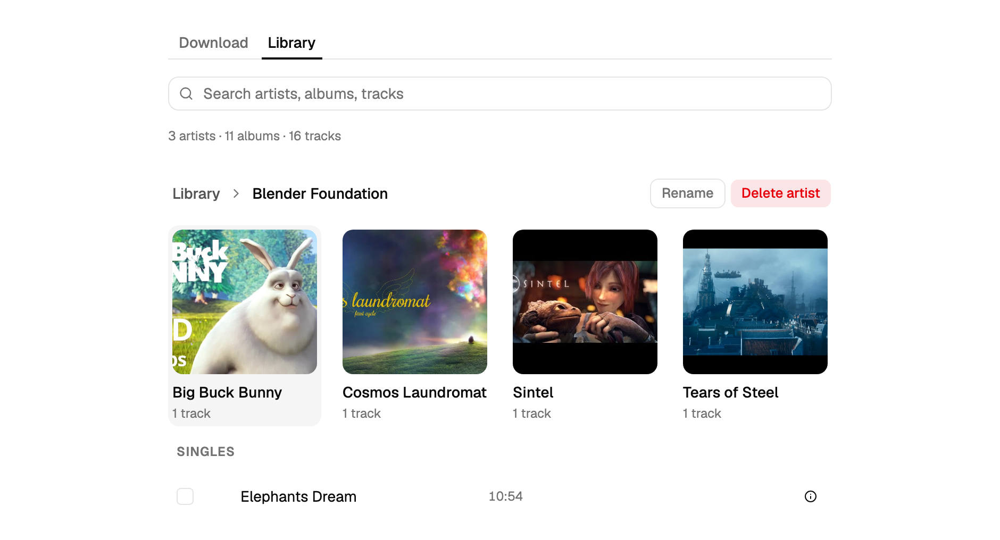
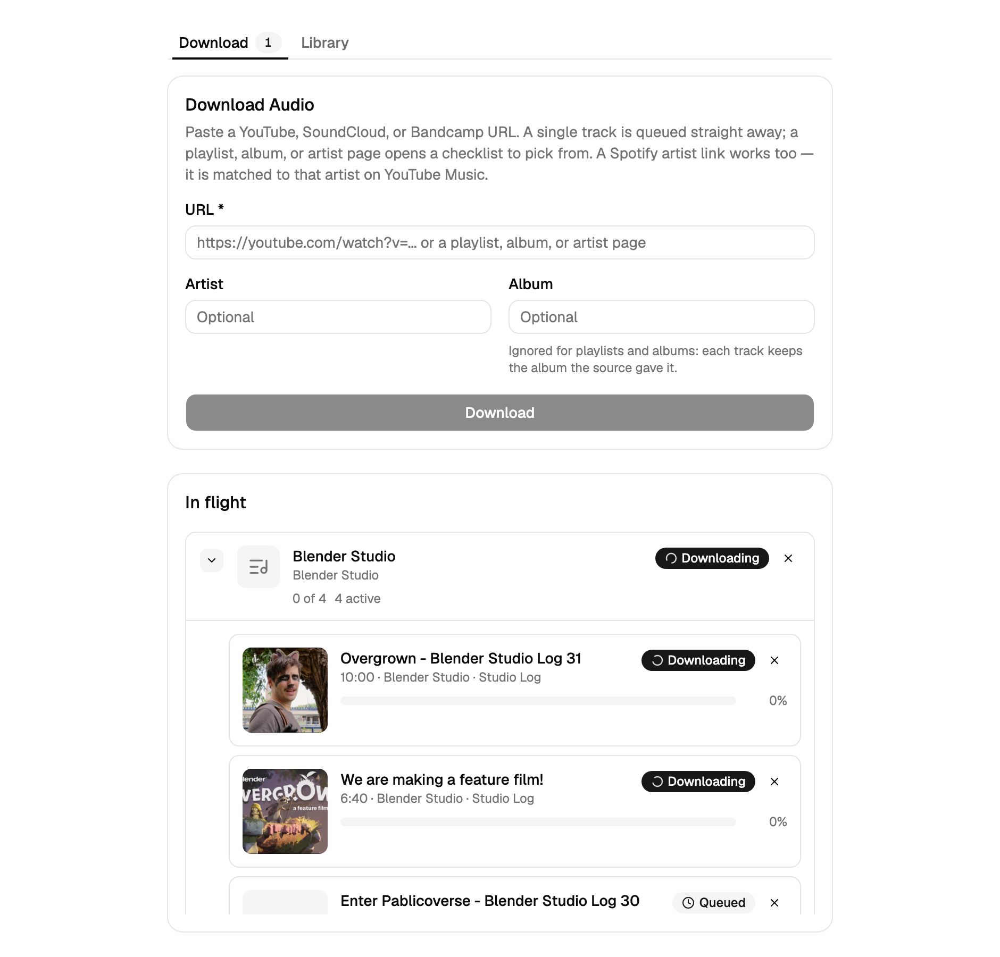

# music-for-arr

This is a project for educational purpose, to learn the usage of the library yt-dlp to test download of
royalty free content from different sources. It downloads a track, a playlist, an album or a whole artist
page to FLAC, files the result as `Artist/Album/track.flac`, corrects the tags against MusicBrainz, and tells
Navidrome and Lidarr to rescan, so the output drops straight into an existing music library.

## Screenshots

The Library tab, inside an artist: its albums and its loose Singles.



The Download tab, with a bulk download expanded to its per-track children.



## How It Works

The UI is three tabs.

- **Download** holds the URL form and the in-flight queue, with a badge counting the jobs still working.
- **Library** browses `DOWNLOAD_PATH`: artist grid, album grid, numbered track list, with a flat search.
- **Trash** appears with a count once something has been deleted, and is hidden otherwise.

Real-time progress reaches the browser over Server-Sent Events. There is no polling.

### Downloading one track

Paste a YouTube, SoundCloud or Bandcamp URL, optionally naming the artist and the album. Every submit first
asks `POST /download/probe` what is behind the URL. A single track comes back with its title, thumbnail and
duration already extracted, and is queued straight away. The same form also accepts a Spotify artist link,
which is never downloaded from but handed to the checklist preview (see
[Spotify artist pages](#spotify-artist-pages)).

The job then runs a three-stage pipeline:

1. **yt-dlp** fetches the best audio stream and the thumbnail, with no postprocessing of its own.
2. An **ffmpeg** subprocess of ours converts that stream to FLAC. Because the process is ours, a cancel kills
   it rather than waiting it out.
3. **Mutagen** writes the tags, the embedded cover art, and the `SOURCEID`/`SOURCEURL` fields that record
   where the track came from. Duplicate detection reads those fields later.

The file lands at `DOWNLOAD_PATH/Artist/Album/track.flac`, falling back to `Unknown Artist` when no artist is
known. A track with no album is a Single: it lands at `DOWNLOAD_PATH/Artist/track.flac` with no `ALBUM` tag.
A download whose target file already exists is stopped and shown as "already in library"; nothing is ever
overwritten.

### Downloading a playlist, album or artist page

A URL that turns out to hold more than one track opens a flat checklist instead of queueing anything:
checkbox, title, album, duration and status per row, with **Select all**, **Select none** and a selected
count. Rows already in the library start unticked and labelled; rows the enumeration reports as unavailable
are greyed out and cannot be ticked. The artist field sits at the top, applies to every track, and re-checks
the library against what you type. Above 500 rows nothing is preselected and a warning appears; more than
2000 rows is a hard stop asking for a narrower URL.

Submitting posts the ticked rows to `POST /download/bulk`, which creates one **parent** job and one child job
per track. The queue shows the parent as a single row with *N of M* progress and the counts, expandable to
its children. Cancel on the parent cascades to every child still running, Retry works on a single failed
child, and Dismiss on the parent removes the whole thing.

#### YouTube channels and YouTube Music artists

A YouTube channel or YouTube Music artist URL is handled differently. `youtube.com/channel/UC…`,
`youtube.com/@handle`, `youtube.com/c/Name` and `youtube.com/user/name` (each with or without a tab such as
`/videos`, `/releases` or `/featured`), plus `music.youtube.com/channel/…` and `/browse/…`, are looked up on
YouTube Music with keyless [`ytmusicapi`](https://github.com/sigma67/ytmusicapi) rather than crawled with
yt-dlp.

The preview is then the artist's **discography** — every album, EP and single with its real track titles and
durations — instead of the channel's uploads, which is what keeps the Shorts, the live sets and the
visualiser re-uploads out of it. The lever is that the Videos tab is never enumerated, not a filter over the
uploads: a release whose track is an official-video upload is still that upload. A `/videos` URL is read the
same way and the preview says so, since the tab you pasted is not the tab you got.

Album and EP tracks land in `DOWNLOAD_PATH/Artist/Album/track.flac`; a single's tracks have no album and land
as Singles at `DOWNLOAD_PATH/Artist/track.flac`, and a track on both an EP and its own single is filed under
the EP. Every spelling of one channel shares a cached enumeration. A channel YouTube Music does not hold as
an artist (a podcast, a talking-head channel) falls back silently to the flat yt-dlp listing. A channel
YouTube Music could not be reached about falls back the same way, with a notice saying so.

#### Spotify artist pages

A pasted `open.spotify.com/artist/...` is read for the artist's *name* only, from the public oEmbed endpoint
and then the page title. No credentials, no API key, no account. That name is searched on YouTube Music, the
top artist match is taken without a picker, and its discography becomes the preview. The preview names the
artist it matched and says the two catalogues may differ; the artist field stays editable. Nothing is ever
downloaded from Spotify.

#### Bandcamp artist pages

A `<name>.bandcamp.com/` or `/music` URL is enumerated by yt-dlp, which builds the whole listing out of the
subdomain: the artist would come out as `amelielens` rather than `Amelie Lens`, and no MusicBrainz lookup
matches a subdomain. So the probe reads the page itself once — the `data-band` attribute, then `og:site_name`,
then the `Music | <Name>` title — and offers that name instead, falling back to the subdomain when the page
cannot be read. One request per page, never one per track.

### Fixing the tags

With the track filed, the download slot is freed and the job moves to **tagging**. It queues for the single
tagging worker, which asks MusicBrainz about the cleaned title, the artist folder and the duration. On a
confident match (duration within 5 s, same title, same artist) it rewrites `TITLE` and `ARTIST` and strips
yt-dlp's leftovers. Below that bar it changes nothing. `ALBUMARTIST`, `ALBUM`, `SOURCEID`, `SOURCEURL` and the
cover art are never touched, and no MusicBrainz ids are written.

Either way the job reaches **done**. A lookup that failed says "tags not fixed" in the job's detail and never
fails the download. `TAG_FIX_ENABLED=false` skips the lookup entirely, and then no request leaves the
container.

### Rate limits

A large playlist at full concurrency is a burst of requests, and YouTube answers a burst with HTTP 429. yt-dlp
does nothing about that on its own: its YouTube extractor never retries a 429, and it ignores `Retry-After`.
So the app handles it.

**Prevention first.** Each track costs exactly one page read — the metadata and the download are one yt-dlp
session, not two — and `YTDLP_SLEEP_REQUESTS` (0.75 s by default, yt-dlp's own `-t sleep` value) paces every
request the app makes, playlist previews included. At most **two YouTube downloads** run at once whatever
`MAX_CONCURRENT_DOWNLOADS` says; other sources fill the remaining slots.

**Lanes.** Each source — YouTube, SoundCloud, Bandcamp — has a lane that is either open or held. When a
download is rate limited its job does not fail: it stays `downloading` and the whole lane is held for 30 s,
then 60, 120, 240 and 480 s if it keeps happening (with jitter, and never shorter than a `Retry-After` the
server sent). The waiting job shows a countdown — "YouTube rate limit, retry 2 of 5 in 45 s" if it was the one
that met the limiter, "YouTube rate limit, waiting 45 s" if it is only queued behind someone else's — and the
wait does not count against `DOWNLOAD_TIMEOUT_SECONDS`. Cancel works immediately during a wait.

A waiting job keeps its YouTube lane slot but **frees its download slot**, so SoundCloud and Bandcamp keep
downloading while YouTube is being waited out. The lane slot is what stops the next YouTube job taking its
place and walking into the same limiter; the download slot is not doing anything while the job is parked.

A hold that runs out with **nothing waiting on it** — one started by a refused playlist preview, say — simply
clears itself and the banner goes. The backoff ladder does not reset, though: no request went out, so nothing
was learned about whether the limiter let go, and the next 429 waits as long as the one before it would have.

**One canary.** When a hold lapses, exactly one waiting job goes first, and the rows behind it say so
("waiting for the first download to get through"). If it gets through, the lane opens and the rest follow; if
it is rate limited again, only that one job spent an attempt and the hold is extended. A
job that spends all `RATE_LIMIT_ATTEMPTS` (5) attempts fails with "YouTube rate limit: gave up after 5
attempts over 15 min", and the lane stays held — the jobs behind it keep waiting rather than each burning
their own budget. If a lane has been in trouble for over an hour *with jobs waiting on it*, everything queued
on it fails at once rather than sitting there silently; a download that is running at that moment is left
alone to finish.

While a lane is held, a **banner** says so, counts down, and offers **Resume now**, which clears the hold and
sends one job straight through. Pasting a URL for that source into the form is refused with the same message
instead of adding to the pile — including a Spotify artist URL, which is read through YouTube Music and so
belongs to the YouTube lane. The hold is stored in `queue.db`, so restarting the container does not walk
straight back into the limiter, and a job that was only waiting when the container stopped is re-queued
without spending one of its three restart attempts.

**PO tokens.** YouTube expects a proof-of-origin token with every player request; without one an anonymous
client loses formats and meets the bot check within a few dozen downloads. The stack runs a
[`pot-provider`](https://github.com/Brainicism/bgutil-ytdlp-pot-provider) sidecar that mints them, and the
backend uses it through that project's yt-dlp plugin. It is on by default, needs no account, and is reachable
only from the backend over the compose network. The backend log names the providers it loaded at startup:

```
PO-token providers       = BgUtilHTTP, BgUtilScriptDeno, BgUtilScriptNode
```

If YouTube asks you to **sign in to confirm you're not a bot**, that job fails immediately (retrying a wall
only makes it worse), the lane is paused with a banner, and nothing else from that source is attempted until
you press Resume now. See [YouTube asks you to sign in](#youtube-asks-you-to-sign-in).

### The queue

Queue rows carry Cancel and Dismiss; a failed row also offers **Retry**, which re-queues the job from the
start (a skipped row and a bulk parent do not get one; retry a bulk download's failed child instead). A row
is **skipped** rather than failed when nothing went wrong and retrying could not help: the track was already
in the library, or its Bandcamp seller has streaming turned off.
**Cancel** stops a job that is queued, downloading or converting, and removes
every partial and temporary file. Cancelled jobs leave the queue and are not retried; resubmit the URL
instead. Cancelling a job that is already **tagging** stops only the tag fix: the track is in the library, so
the job finishes as done with "tags not fixed: cancelled". A MusicBrainz request already in flight cannot be
interrupted, so the cancel lands when that request returns. **Dismiss** removes a failed job, which is
otherwise kept until you have seen it.

The queue is stored in SQLite at `DATA_PATH/queue.db`, so it survives a restart. Queued jobs come back
queued. A job that was mid-download when the process stopped has its partial files cleaned up and is retried
automatically; three interrupted attempts and it is marked failed instead. Finished and cancelled jobs are
pruned after seven days, failed ones stay until dismissed, and `GET /queue` only ever returns in-flight and
failed jobs.

### The Library tab

The Library tab reads `DOWNLOAD_PATH` directly: artist folders at depth 1, album folders at depth 2, audio
files at depth 3, and loose files under an artist as Singles. Files at the root show under a synthetic
**Unknown Artist** marked as needing sorting, and folders nested deeper than an album are flattened into it.
Nothing is tidied automatically. `.trash` and the per-job `.tmp` scratch directory are skipped.

Each track shows its title (from the tags, else the filename), its duration, a format badge when it is not
FLAC, and a detail popover with the size and the full tag set. Cover art comes from the embedded picture of
the first track that carries one, else a `cover.jpg`, `cover.jpeg`, `cover.png` or `folder.jpg` sidecar
(matched case-insensitively), else a generated placeholder. Search is flat across artists, albums and
tracks; the breadcrumb goes back up.

#### Move and rename

Tick tracks and use **Move selected**, use **Move** on a single row, **Move album** to hand an album to
another artist, or **Rename** an artist. The dialog's Artist and Album fields suggest what the library
already has and accept a new name, which creates the folder; leaving Album blank files the track loose under
the artist as a Single.

A move rewrites `ALBUMARTIST` and `ALBUM` to match the new folders (a blank album removes the `ALBUM` tag; an
artist rename leaves `ALBUM` alone) and leaves every other tag alone. `ARTIST` follows too, unless the track's
own `ARTIST` already disagreed with the artist folder it is leaving: a guest credit or a compilation track
keeps its own. A track loose in the library root has no such folder, so its `ARTIST` is written outright.
Folders left without audio are removed. A move is all-or-nothing: if anything is already in the way
the whole move is refused and the conflicting paths are listed in the dialog.

#### Delete and the trash

Delete is offered on a track, a multi-selection of tracks, a whole album, or a whole artist. One dialog names
what is going and how many tracks it holds. Nothing is erased: the item moves, as a single entry, to
`DOWNLOAD_PATH/.trash/<UTC timestamp>/<its original path>`. That is a rename on the same filesystem, so it is
instant whatever the size, and an album or artist keeps its folder intact, a cover sidecar included.
Folders left without audio are cleaned up afterwards, as they are after a move.

The **Trash** tab appears with a count as soon as something is in it. Each entry lists its original path,
when it was deleted, and its track count, with **Restore** to put it back where it came from. Restore never
overwrites: if something has taken the old path in the meantime the restore is refused and the move dialog
opens so you can file the entry elsewhere. **Empty trash** confirms with the total, then removes the contents
for good.

Nothing in the trash expires on its own. It sits there until you empty it, and it is invisible everywhere
else: it never shows in the Library tab, and a trashed track no longer counts as a duplicate, so you can
download it again without the "already in library" refusal. Navidrome and Lidarr both skip `.trash`; see
[Navidrome and Lidarr](#navidrome-and-lidarr).

Deleting something an in-flight job is about to write is refused until that job finishes. The same guard
applies to moves, renames and manual tagging.

#### Update metadata

**Update metadata** is offered on a track row and on an album header. Both queue a **tagging** job, which
appears in the in-flight queue next to the downloads, can be cancelled while it runs, retried when it fails,
and dismissed once you have seen the failure. There is deliberately no per-artist or whole-library button.

A track run redoes the fix a download does automatically. An album run looks every track in the folder up and
shows its progress as *N of M*. When all of them match and all of them map to one believable MusicBrainz
release (not a bootleg, not a tribute, not a greatest-hits compilation, all of which carry the same
recordings the album does) it also writes `TRACKNUMBER` and `DISCNUMBER` from that release's tracklist and
fetches `cover.jpg` from the Cover Art Archive: the release's front image, else the release group's.
Otherwise it applies the per-track fixes on their own and writes no numbers and no cover: when every track
matched but no believable release holds them all, the job says `no common release; track numbers and cover
not written`; when not every track matched, it says `partial: 9 of 12`.

Finding that one release takes two goes. MusicBrainz lists a popular recording once per release that
duplicated it, so on a heavily duplicated album no single release shows up in *every* track's search results.
When every track matched but no believable release is common to all of them, the pass ranks the releases the
folder points at, by the same three tests, dropping anything credited to another artist, anything that is not
an official release, and anything the release group calls a compilation. It then reads up to three of those
tracklists and takes the first that holds every track in the folder at the same title, length and artist bar.
One of those three that cannot be read is skipped rather than failing the job. That costs one to three extra
MusicBrainz requests, and none at all on a folder the first go already resolved.

An existing cover sidecar (`cover.jpg`, `cover.jpeg`, `cover.png` or `folder.jpg`, matched
case-insensitively) is never overwritten, embedded artwork is left alone, no MusicBrainz id is ever written,
and `ALBUM`/`ALBUMARTIST` stay whatever the folders say. A loose Single gets title and artist only: never a
track number, never an `ALBUM` tag, never cover art. Non-FLAC files count towards the
album's total but are never touched, and because they can never match, a single non-FLAC file in a folder
keeps that album off the numbers-and-cover path for good: it always reports `partial: 11 of 12`. Nothing is
remembered about what matched, so running the pass again asks again.

Unlike a download, which always finishes and says "tags not fixed" in its detail when the lookup failed, a
tagging job whose whole purpose was to fix tags **fails** when MusicBrainz cannot be reached, when the lookup
times out, or when a file cannot be written, and stays in the queue with a Retry and a Dismiss. "No match" is
not a failure: the job finishes with `tags not fixed: no match`. Cancelling mid-album leaves the tracks
already written as they are and the rest untouched.

## Architecture

```
Browser --HTTPS--> reverse proxy --> nginx :3033 --+-- /        React SPA (TanStack Query + SSE)
                                                   |
                                                   +-- /api/*   FastAPI :8000, not exposed to the host
                                                                    |
        +-----------------------------+-------------------------------------------+
        |                             |                                           |
  queue.db (SQLite)            worker slots                                 DOWNLOAD_PATH
  at DATA_PATH                 MAX_CONCURRENT_DOWNLOADS download slots      the library tree,
  jobs, states, lanes,         (at most 2 of them YouTube at a time)        the only source of truth
  retention                    plus exactly one tagging slot

                                      |
                                      +--> pot-provider :4416, compose network only
                                           mints YouTube PO tokens for yt-dlp

  Outbound, from the workers:
    yt-dlp       ->  YouTube, SoundCloud, Bandcamp     (the audio itself)
    ytmusicapi   ->  YouTube Music                     (artist discographies, keyless)
    Spotify      ->  oEmbed and the page title         (an artist name, nothing else)
    MusicBrainz  ->  tag lookups                       Cover Art Archive -> cover.jpg
    Navidrome    ->  Subsonic startScan                Lidarr -> RescanFolders
```

The frontend's nginx container proxies all `/api/` requests to the backend container over the internal Docker
network. The backend is not exposed to the host: all traffic flows through the frontend. This lets the
application work behind an HTTPS reverse proxy without mixed-content issues.

There is no library table. The filesystem under `DOWNLOAD_PATH` is the only source of truth for the library,
and a track, album or artist is identified by its POSIX path relative to that root. `GET /library` serves from
an in-memory scan cache keyed by folder mtimes, so only albums that changed are re-read; covers are cached on
disk keyed by the album path plus a change stamp over the folder.

SQLite holds the job queue and nothing else. Every state transition is written to `queue.db` before its SSE
event reaches a client, so a client that reacts to an event and reads back always sees the same thing.

### API routes

| Route | Purpose |
| ----- | ------- |
| `GET /health` | Liveness, used by the container healthcheck |
| `GET /notices` | The dismissible banners (rescan failures, Lidarr tag scrubbing, rate-limit holds) |
| `POST /download` | Queue one track |
| `POST /download/probe` | Classify a URL: `{type: "track"}` or a preview payload |
| `POST /download/bulk` | Queue a selection from a preview: one parent, one child per track |
| `GET /queue` | In-flight and failed jobs, parents with their children nested |
| `GET /queue/stream` | SSE: `status_change`, `progress`, `metadata`, `error`, `library_changed`, `notices` |
| `POST /queue/{id}/retry` | Retry a failed job |
| `POST /queue/{id}/cancel` | Cancel a job, cascading to children |
| `POST /queue/{id}/dismiss` | Delete a failed job row |
| `POST /queue/lanes/{host}/resume` | Clear a source's rate-limit hold and release one job |
| `GET /library` | The whole tree: artists, albums, tracks, Singles |
| `GET /library/cover?path=` | Cover art for an album path |
| `POST /library/move` | Move tracks, move an album, rename an artist |
| `POST /library/delete` | Move something into the trash |
| `POST /library/tag` | Queue a tagging job for a track or an album |
| `GET /library/trash` | List trash entries |
| `POST /library/trash/restore` | Restore one entry |
| `POST /library/trash/empty` | Empty the trash |

Library paths travel as a JSON body field (`path` or `paths`), never as URL segments. Job ids stay in URL
segments.

## Tech Stack

| Layer    | Technology                                                                                               |
| -------- | -------------------------------------------------------------------------------------------------------- |
| Frontend | React 19, TypeScript 5.9, Vite 7, TanStack Query 5, Tailwind 4, shadcn/ui, Vitest 4                      |
| Backend  | Python 3.12, FastAPI 0.141, uvicorn, Pydantic 2, sse-starlette, httpx                                    |
| Media    | yt-dlp (floor 2026.08.19, rebuilt weekly), ffmpeg (Debian stable, currently 7.1), Mutagen 1.48, deno 2.9 |
| Metadata | musicbrainzngs 0.7.1, ytmusicapi 1.12.2, Cover Art Archive                                               |
| Storage  | SQLite (stdlib `sqlite3`, WAL) for the queue; the filesystem for the library                             |
| Infra    | Docker Compose, nginx                                                                                    |

## Getting Started (development)

This is the path for working on the code locally. It builds both images from
source: `docker-compose.override.yml` is merged automatically by Compose and
supplies the `build:` blocks.

```bash
# Clone the repository
git clone <repo-url> && cd music-for-arr

# Configure environment
cp .env.example .env
# Edit .env with your settings (see Configuration below)

# Create the download directory and give it to PUID:PGID
sudo mkdir -p /data/music/downloads && sudo chown 1000:1000 /data/music/downloads

# Build and start the stack
docker compose up --build -d
```

The application is available at `http://localhost:3033` (configurable via `FRONTEND_PORT`). Place a reverse
proxy in front for HTTPS access.

The frontend tests are `cd frontend && npx vitest run`, the backend tests
`cd backend && python -m venv .venv && .venv/bin/pip install -r requirements-dev.txt && .venv/bin/python -m pytest -q`.

## Deploying to the homelab

The homelab runs the prebuilt images that CI publishes to GHCR. It never builds
anything, and it never needs a checkout of this repository.

**Minimum versions: Docker Engine 25 and Compose 2.20.** The stack uses
`depends_on.required` (Compose 2.20+) so an unhealthy PO-token sidecar never
blocks the backend from starting, and `healthcheck.start_interval` (Engine 25+)
so that sidecar is marked healthy in seconds rather than in half a minute.

**Images are private.** They live at `ghcr.io/architdharod/music-for-arr-backend`
and `ghcr.io/architdharod/music-for-arr-frontend`, so the host must authenticate
before it can pull.

1. Create a fine-grained personal access token on GitHub under
   *Settings > Developer settings > Personal access tokens > Fine-grained tokens*.
   Give it access to this repository and the single permission
   **Packages: Read-only** (`read:packages`). Nothing else is required.
2. Log in on the homelab host:

   ```bash
   docker login ghcr.io -u <github-user>
   # paste the token as the password
   ```

3. Copy **only** `docker-compose.yml` and your `.env` to the host. Do not clone
   the repo, and do not copy `docker-compose.override.yml` — its `build:` blocks
   would make Compose try to build from sources that are not there.
4. Create `DOWNLOAD_PATH` on the host and give it to `PUID:PGID` (default
   `1000:1000`). Compose bind-mounts that directory into the backend at the same
   path, and Docker would otherwise create it owned by `root`:

   ```bash
   sudo mkdir -p /data/music/downloads
   sudo chown 1000:1000 /data/music/downloads
   ```

5. First start:

   ```bash
   docker compose pull && docker compose up -d
   ```

Updating is the same two commands. Every push to `main` republishes `latest`,
and a scheduled job rebuilds both images every Monday morning so `latest` always
carries a recent yt-dlp: the pin in `backend/requirements.txt` is a floor
(`yt-dlp>=...`), so each rebuild picks up the newest release. That weekly rebuild
is the mechanism that keeps downloads working when YouTube changes something.

**Rollback.** Every build is also tagged immutably: `sha-<short commit sha>` for
pushes to `main`, and `weekly-<YYYYMMDD>` for the Monday rebuilds. To go back,
edit the `image:` line in `docker-compose.yml` on the host to the tag you want
and re-run `docker compose up -d`:

```yaml
image: ghcr.io/architdharod/music-for-arr-backend:weekly-20260817
```

**Data.** The backend gets a named volume `music-for-arr-data` mounted at
`/config`, which `DATA_PATH` points at. This is where `queue.db` lives, so
restarting or updating the backend does not lose the queue. The volume is
separate from `DOWNLOAD_PATH` on purpose, so app state never sits in the tree
Navidrome and Lidarr scan. Downloads themselves go to the `DOWNLOAD_PATH` bind
mount and are unaffected.

## Configuration

All configuration is via environment variables in `.env`. These are the effective
defaults: for the variables `docker-compose.yml` passes through, it substitutes
them when the variable is unset or empty, so an incomplete `.env` does not break
the stack. `.env.example` ships the same values.

| Variable                   | Default                 | Description                                              |
| -------------------------- | ----------------------- | -------------------------------------------------------- |
| `FRONTEND_PORT`            | `3033`                  | Host port for the web UI                                 |
| `PUID`                     | `1000`                  | UID the backend container runs as                        |
| `PGID`                     | `1000`                  | GID the backend container runs as                        |
| `DOWNLOAD_PATH`            | `/data/music/downloads` | Directory where FLAC files are saved, bind-mounted at the same path inside the container |
| `DATA_PATH`                | `/config`               | Directory holding `queue.db`, the persistent job queue. `docker-compose.yml` hardcodes `/config`, a named volume, so setting this in `.env` under compose does nothing; it applies when the backend runs outside compose |
| `DOWNLOAD_TIMEOUT_SECONDS` | `900`                   | Per-job timeout in seconds (15 min)                      |
| `MAX_CONCURRENT_DOWNLOADS` | `2`                     | Maximum simultaneous downloads. Tagging is always one at a time and has its own slot |
| `PROBE_TIMEOUT_SECONDS`    | `120`                   | How long `POST /download/probe` may spend enumerating a URL before it answers 504 |
| `CORS_ORIGINS`             | unset                   | Dev only: comma-separated browser origins allowed to call the API directly. Read only when the backend runs outside compose — it is deliberately not in `docker-compose.yml`'s environment block, so setting it in `.env` under compose does nothing. Not needed for the compose stack anyway, where the UI is same-origin behind nginx |
| `NAVIDROME_URL`            | empty (disabled)        | Navidrome base URL, e.g. `http://navidrome:4533`, without a trailing `/rest` |
| `NAVIDROME_USER`           | empty (disabled)        | Navidrome user to scan as; must be an admin                             |
| `NAVIDROME_PASSWORD`       | empty (disabled)        | That user's password; the app derives a token and salt per request      |
| `LIDARR_URL`               | empty (disabled)        | Lidarr base URL, e.g. `http://lidarr:8686`                              |
| `LIDARR_API_KEY`           | empty (disabled)        | Lidarr API key, from Settings > General                                 |
| `LIDARR_ROOT_FOLDER`       | Lidarr's first          | The root folder to rescan, as Lidarr sees it                            |
| `TAG_FIX_ENABLED`          | `true`                  | Look every finished download up on MusicBrainz and correct its `TITLE`/`ARTIST`. `false` skips the lookup, and no request leaves the container |
| `MUSICBRAINZ_CONTACT`      | this repository's URL   | Contact (email or URL) in the User-Agent MusicBrainz requires           |
| `TAG_FIX_TIMEOUT_SECONDS`  | `60`                    | How long one tag lookup may take before the job finishes without it     |
| `YTDLP_SLEEP_REQUESTS`     | `0.75`                  | Seconds yt-dlp sleeps between extractor requests, in every session including the playlist preview. `0` turns the pacing off. See [Rate limits](#rate-limits) |
| `RATE_LIMIT_ATTEMPTS`      | `5`                     | How many times one job waits out a rate limit before it fails. A manual Retry always starts a fresh budget |
| `POT_PROVIDER_URL`         | `http://pot-provider:4416` | The PO-token sidecar the compose stack runs. Empty disables it, which makes YouTube's bot check much more likely |
| `YTDLP_COOKIES_FILE`       | empty (disabled)        | Path *inside the container* to a Netscape-format cookies file yt-dlp should use. See [YouTube asks you to sign in](#youtube-asks-you-to-sign-in) |
| `YTDLP_COOKIES_HOST_PATH`  | `/dev/null`             | Path *on the host* to that same file. Compose bind-mounts it read-only at `/cookies/youtube.txt` |

`DOWNLOAD_PATH` must already exist on the host and be writable by `PUID:PGID`
(default `1000:1000`). The backend checks this at startup and **refuses to
start** if the directory is missing or not writable, rather than failing on the
first download. If Docker creates the directory for you it will be owned by
`root`, so create it yourself and `chown` it first.

`DATA_PATH` (the queue database) is checked the same way. The backend image
pre-creates `/config` world-writable, so the named volume compose mounts there
inherits that mode and is writable whatever `PUID:PGID` you run as. If you
replace the named volume with a bind mount of a host directory, that directory
must exist and be writable by `PUID:PGID` yourself.

### YouTube asks you to sign in

Symptom: every YouTube job fails with **"Sign in to confirm you're not a bot"**,
often after a burst of HTTP 429s in the backend log. This is YouTube rate-limiting
the datacentre or home IP the container downloads from, not a bug in the app. The
job that hits the wall fails at once and the whole YouTube lane is paused with a
banner, so nothing else piles into it; **Resume now** on that banner is what tries
again once you have changed something. Three things help, in this order.

**Check the PO-token sidecar is running.** This is the first answer and it is on
by default: the `pot-provider` service mints the proof-of-origin tokens YouTube
expects, and without them an anonymous client meets this wall within a few dozen
downloads. The backend says at startup which providers it loaded —

```
POT_PROVIDER_URL         = http://pot-provider:4416
PO-token providers       = BgUtilHTTP, BgUtilScriptDeno, BgUtilScriptNode
```

— and at `-v` level yt-dlp logs `Generating a gvs PO Token for web client via
bgutil HTTP server` when it actually fetches one. If `PO-token providers` reads
`(none)`, your image predates the sidecar and needs rebuilding or repulling; if
it lists the providers but downloads still fail, check that the `pot-provider`
container is up.

**The image ships a JavaScript runtime.** YouTube's player is protected by a
challenge that yt-dlp solves by running JavaScript, so the backend image
installs [deno](https://deno.com) and yt-dlp's `yt-dlp-ejs` scripts. Without
them yt-dlp logs `No supported JavaScript runtime could be found`, some formats
disappear, and the bot check fires much sooner. If you see that line in the log,
your image predates this and needs rebuilding or repulling.

**Give yt-dlp cookies — the last resort.** Only after the two above: a cookies
file is a live session for a real Google account, it has to be re-exported by
hand whenever it goes stale, and yt-dlp warns that an account it downloads with
can be banned. A signed-in session does get waved through where an anonymous one
does not:

1. Export the cookies exactly the way yt-dlp's
   [Exporting YouTube cookies](https://github.com/yt-dlp/yt-dlp/wiki/Extractors#exporting-youtube-cookies)
   page describes, because the order of the steps is what keeps the exported
   session alive:

   1. Open a new **private/incognito window** and sign in to YouTube with a
      **throwaway Google account**. The file is a live session — anyone who
      reads it is signed in as that account — and yt-dlp warns that an account
      it downloads with can be banned, so do not use your main one.
   2. In that same window and tab, navigate to
      `https://www.youtube.com/robots.txt`, and make sure it is the only
      YouTube tab open in the window.
   3. Export the `youtube.com` cookies with a cookies.txt browser extension
      (yt-dlp's
      [FAQ](https://github.com/yt-dlp/yt-dlp/wiki/FAQ#how-do-i-pass-cookies-to-yt-dlp)
      covers the Netscape file format and which extensions produce it), then
      **close the private window**. Closing it is what stops the browser from
      rotating the exported cookies out from under you.

2. Save the exported `cookies.txt` on the host somewhere the container user can
   read, e.g. `/srv/music-for-arr/youtube-cookies.txt`, and `chmod 600` it.
3. Set both variables in `.env` and restart the stack:

   ```
   YTDLP_COOKIES_HOST_PATH=/srv/music-for-arr/youtube-cookies.txt
   YTDLP_COOKIES_FILE=/cookies/youtube.txt
   ```

   `YTDLP_COOKIES_HOST_PATH` is what compose bind-mounts, always **read-only**,
   at the fixed container path `/cookies/youtube.txt`; `YTDLP_COOKIES_FILE` is
   what the backend reads. Compose cannot mount a volume conditionally, so the
   host path defaults to `/dev/null`: with neither variable set the stack
   starts exactly as before and no cookies are used.

   Get `YTDLP_COOKIES_HOST_PATH` right the first time. If the path does not
   exist on the host, Docker creates an empty **directory** of that name and
   mounts it, which the backend then rejects at startup.

   The mount is read-only on purpose, and safe to leave that way: the backend
   reads the file once at startup into a cookie jar it holds in memory and
   shares with every download, and never hands yt-dlp a `cookiefile` to write
   back to. Your file is only ever read. The flip side is that cookies YouTube
   rotates during a download live only in memory and are lost when the
   container restarts, so re-export the file when the bot check comes back.
   Cookie contents are never logged, only the path and the number of cookies
   loaded.

   If `YTDLP_COOKIES_FILE` points at something that is missing, unreadable, not
   a regular file, or not a Netscape-format cookies file, the backend
   **refuses to start** and says which, the same way it does for a bad
   `DOWNLOAD_PATH`.

**Keep `MAX_CONCURRENT_DOWNLOADS` at 2.** Its default, and raising it is the
fastest way to earn a 429 and, shortly after, the bot check. The app caps
YouTube at two concurrent downloads whatever this is set to, so raising it only
speeds up the other sources; leaving it at 2 keeps everything modest. If you are
already being blocked, wait it out — the queue does that for you, and the block
is on the IP and expires. `YTDLP_SLEEP_REQUESTS` is the other dial: raising it
above 0.75 makes a large playlist or album slower and safer.

## Navidrome and Lidarr

After every change to the library the backend waits five seconds for the writing
to stop, touches the album folders that changed, and then asks Navidrome and
Lidarr to rescan, once, however many tracks landed. Each service is skipped
when its variables are empty, and a failure never fails a download: it shows as
a dismissible banner in the UI and a line in the log.

**Navidrome.** `startScan` is admin-only, so `NAVIDROME_USER` must be an admin;
create a dedicated user for it rather than reusing your own. Set
`ND_SCANNER_PURGEMISSING=always` on the Navidrome container (Navidrome 0.56.0 or
newer), or tracks this app deletes stay in Navidrome's database as unplayable
entries. The trash needs no configuration of its own: Navidrome skips dot-prefixed
folders, and the app drops an empty `.ndignore` file into `.trash` as well, so the
folder stays skipped even if that behaviour ever changes. Navidrome's own
filesystem watcher usually notices new files by itself; the explicit scan is
insurance for the setups where it does not (network mounts, some bind mounts).

**Lidarr.** The rescan is sent with `filter=known` and `addNewArtists=false`, so
only artists Lidarr already tracks are rescanned and nothing this app downloads
is added to Lidarr's library behind your back. Three things on the Lidarr side are
worth knowing:

- Albums you delete here that Lidarr monitors will be searched for again.
  Unmonitor the album in Lidarr if you meant the delete to stick.
- The trash needs no configuration either, and Lidarr has no folder ignore list to
  put it in. Lidarr's scanner skips any dot-prefixed folder beneath a root folder,
  so it never sees `.trash`. Verified against Lidarr **3.1.0.4875** with two
  identical FLAC files, one in the library and one under `.trash`: every
  `RescanFolders` found one file and the trashed path appears nowhere in the logs.
  The test and the source references are in
  `wayfinder/research/lidarr-hidden-folders.md`.
- Leave *Settings > Metadata > Tag Audio Files with Metadata* at `no` or
  `newFiles`, and leave *Scrub Existing Tags* off. Scrubbing strips the
  `SOURCEID` and `SOURCEURL` tags this app writes, which is what its duplicate
  detection reads. The app checks this at startup and again after each rescan,
  and shows a banner while scrubbing is on; turn it off and the banner clears
  after the next rescan.

## Limitations

- **No authentication** — designed for private/internal networks. Anyone who can reach the port can download
  into, move within, and delete from your library.
- **FLAC only** — lossy sources are losslessly wrapped in FLAC for consistent output, and only FLAC files are
  tagged. Non-FLAC files already in the library are listed and moved but never written to.
- **Bandcamp is not lossless** — Bandcamp's free streams are 128 kbps MP3. They are wrapped in FLAC like
  everything else, so the file is large and says FLAC, but the audio is what the stream was. The preview says
  so when the URL is a Bandcamp one.
- **A Spotify artist page is matched, not read** — the artist's *name* is taken from Spotify and searched on
  YouTube Music, and the top match's discography is what you get. It **may differ from the Spotify
  discography**. The preview names the artist it matched and the artist field is editable. Spotify track,
  album and playlist URLs are rejected with a message naming what is supported, and `POST /download` refuses
  any Spotify URL: it is a single-track route.
- **The preview is a flat extraction** — cheap, and thin: a row can only be marked unavailable when the flat
  pass says so. SoundCloud DRM is invisible to it, because yt-dlp only meets the DRM in a full extraction, so
  such a track previews as available and then fails in its own child job with yt-dlp's DRM message. A
  Bandcamp track whose seller has turned off streaming is invisible the same way and for the same reason —
  the streaming switch is only in the full extraction of the track page — so it too previews as available,
  and its child job ends as **skipped**, not failed, reading "Bandcamp: streaming is disabled for this track,
  so there is nothing to download". The preview says so for a Bandcamp album or artist URL; a single Bandcamp
  track URL previews as one track and carries no notices, and one whose streaming is off is refused with that
  message instead of being queued.
- **A fixed host allowlist** — the backend accepts `http`/`https` URLs on `youtube.com`, `youtu.be`,
  `soundcloud.com`, `bandcamp.com` and `open.spotify.com`, each matched exactly or as a subdomain, and
  rejects everything else with a validation error. `music.youtube.com` is a subdomain of `youtube.com`, so
  YouTube Music URLs needed no widening.
- **YouTube runs two at a time** — the per-source cap is not configurable. `MAX_CONCURRENT_DOWNLOADS` above 2
  only speeds up SoundCloud and Bandcamp; a YouTube playlist downloads two tracks at a time whatever you set.
  It is what keeps a large playlist out of the rate limiter.
- **A 429 served as an HTML page is invisible** — YouTube Music occasionally answers a rate limit with HTML
  rather than JSON, which the client can only report as a parse failure. That one shape is treated as "YouTube
  Music is unreachable" and falls back to a flat yt-dlp listing, as it did before.
- **A rate limit is waited out, not worked around** — the queue backs off and retries, but nothing changes
  the IP the requests come from, so a source that is determined to block this server eventually wins: after an
  hour of holding, everything queued on that source fails. The PO-token sidecar makes YouTube's bot check much
  less likely; it does not make it impossible, and a cookies file is still the last resort.
- **The playlist preview does not back off** — `POST /download/probe` answers a rate limit with an error and a
  wait, rather than making you watch a spinner for eight minutes. Try again when the banner says the source is
  answering.
- **No duplicate submissions** — a URL that is already queued or in progress is refused until that job
  finishes.
- **Never overwrites** — a download whose target `Artist/Album/track.flac` already exists is stopped and shown
  as "already in library"; nothing in the library is replaced. A move onto an occupied path is refused the
  same way, as is a restore from the trash.
- **Text-search tagging only** — the automatic fix asks MusicBrainz by title, artist and duration. There is no
  audio fingerprinting, so a live version, a cover, or a sped-up upload is left with the tags it came with.
  Album track numbers and cover art are never part of the *automatic* pass; they come only from the album's
  **Update metadata** button.
